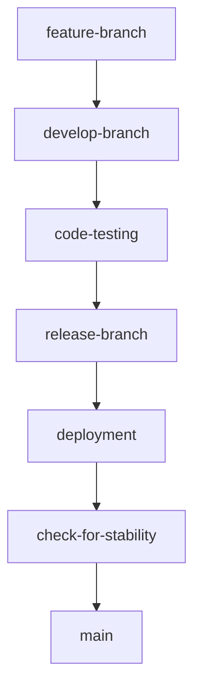
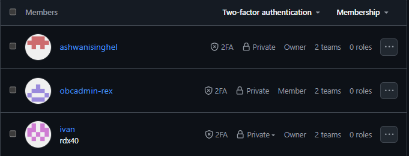
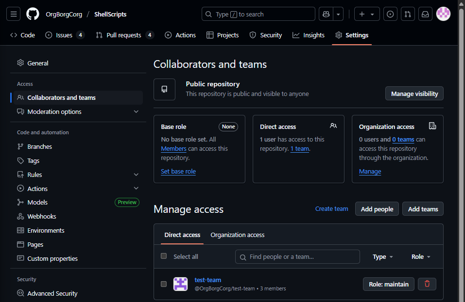
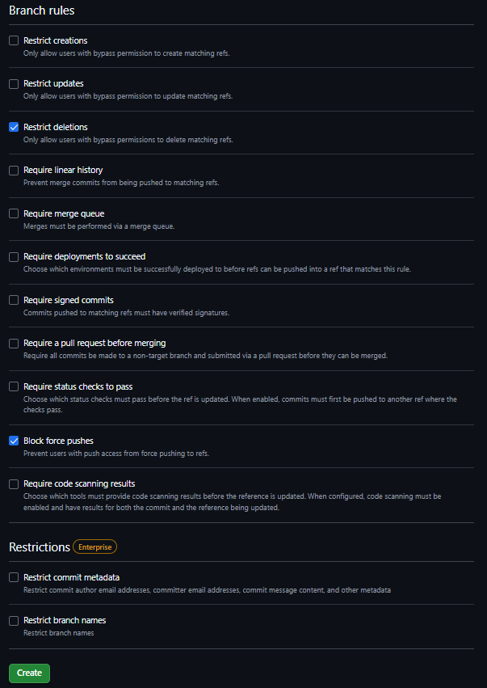

## Before diving into the best branching for git, lets first look at some good practises for using git efficiently and effectively:

- Set up git and create a .gitignore file(to maintain logs, build artifacts, hidden, personal and other unwanted files on the local system but ignored from tracking)
- Write clear, small and focused commit messages
- Use pull requests and code reviews (The new feature of adding copilot as a code reviewer can be utilized whenever and wherever required)
- Protect sensitive data, use access controls and sign commits
- For large projects/monorepos use Git LFS(Git Large File Storage) for versioning large files.

## Now to get into the branching stratergies

- The three common branching stratergies used commonly in the industry

| **Stratergy**     | **Use Case**            | **Pros**                                  | **Cons**                                |
| ----------------- | ----------------------- | ----------------------------------------- | --------------------------------------- |
| Feature Branching | Small-medium projects   | Seperates work, easy to manage            | Can lead to integration issues          |
| GitFlow           | Large, complex projects | Structured releases, good for maintenance | Complex, can slow development           |
| Trunk-Based       | Fast-moving teams       | Simple, promotes continuous integration   | Requires disciplined team, can be risky |

- ### Feature Branching:

  - A way to work on different parts of the project
  - _How it works_:
    - Make a new branch from the main branch. eg. feature/login
    - Change the code in the new created branch
    - Save changes frequently
    - When done, add the new branch to the main code
  - When its **GOOD** to use:
    - Working on many things at once
    - Keeping changes seperate
    - Testing the change before adding to the main code
  - What **ISSUES** could occur:
    - Problems when joining many branches
    - Too many branches to manage

- ### GitFlow:

  - The traditional GitFlow approach is slightly different(Two primary branches being main and develop) than described below.
  - Uses **two** key/static branches: _master_ and _release_ and **one** dynamic branch: the _develop_ branch. Where master is for the finished code and develop is for the work in progress.
  - How it works:
    - Make a new branch from develop eg. feature/login
    - Change the code in the newly created branch
    - Save the changes frequently
    - When done add the new branch to develop
    - Test out the branch
    - Make a release branch from develop. eg release/v1.0
    - Add release to the master.
  - When it is **Good** to use:
    - Versioning the code
    - Keeping changes seperate
    - Testing before adding to the main code
    - Simple to use and understand
    - Because of the simplicity of the workflow, the branching stratergy allows for CI/CD
    - Works great for small teams and for small applications

- ### What I (personally) think would be good (and why)

  - **Branches**:
    - _develop_ : A short lived branch where all new changes are merged from a feature branch. The changes in this branch will be tested and sent to release.
    - _version/release_ : The branch from where the code is deployed and sent to production.
    - _main_ : A few days after release/production is live, if no issues are present, a stable copy of the release branch is merged into this branch.
  - **Suggested Workflow**:
    - Developers create feature branches from the develop branch
    - After completing feature they raise a PR to the develop branch.
    - After code is reviewed and tested, it is merged.
    - After testing if no issues arise, a PR is raised from develop branch into the production ready version/release branch.
    - After a couple days, if no issues arise from the branch, a stable copy is maintained by merging the changes to main by raising a PR.

- ### Branch Protection Rules:

  - main :
    - Require PRs with at least 2 approvals
    - Require all checks to pass before merging
    - Restrict on who can push(eg. only team leads)
  - version/release :
    - Require PRs with at least 1 approval
    - Require all checks to pass before merging
    - Restrict on who can push(eg. only team leads)
  - develop : - No restrictions

- ### Actually setting up branch protection rules:
  - NOTE : _In the case where it is required that all repositories be visible to all members of the team, create a team with all the members and set the required permissions_
  - Created a team of 3 members for the sake of demonstration
  - Two Owners and a member:
    
  - Procced to desired repo and head over to settings
  - Under Access -> Collaborators and Teams -> Manage Access -> Add Teams -> Add team as a maintainer with maintain role
    
  - Head on over to Rules -> Ruleset -> New Ruleset -> New branch ruleset
  - Name the ruleset. Set its enforcement status to active -> Add the Organization admin(in this case the team lead) as the only person in the bypass list
  - Set the target branches
  - Apply required rules as per use case
    
  - Go ahead and create it
